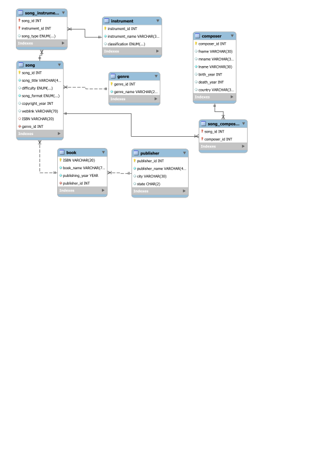

# Sheet Music SQL Database

### ERD

### Git Hub Code Links

__MySQL__: <https://github.com/madl1900/MadisonL_portfolio/tree/main/Full_Stack/sheet_music/MySQL>

__SQL Server__: <https://github.com/madl1900/MadisonL_portfolio/tree/main/Full_Stack/sheet_music/SQL_Server>